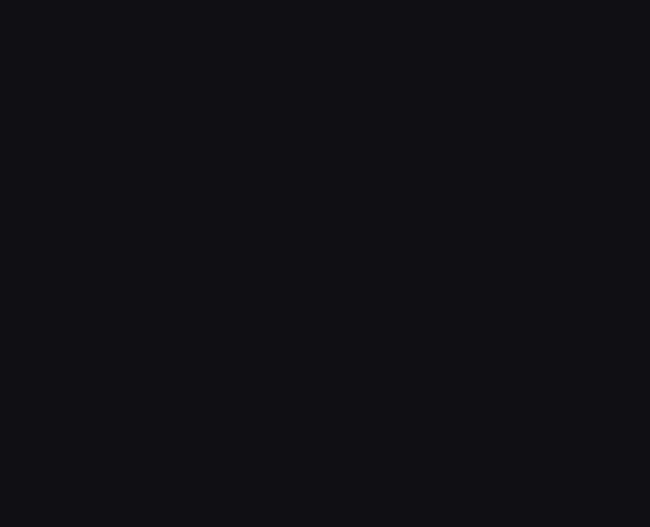

<h1 align="center">Kineglyph</h1>

<p align="center">
  <strong>Technical illustrations with a pulse.</strong><br>
  Typed scenes for diagrams, data graphics, and interactive explainers.<br>
  Render them live or export the same definition to SVG, PNG, and GIF.
</p>

<p align="center">
  <a href="./docs/cookbook.md">Cookbook</a> ·
  <a href="./docs/authoring-api.md">Authoring API</a> ·
  <a href="./packages/plot/README.md">Plots</a> ·
  <a href="./packages/web/README.md">Web runtime</a> ·
  <a href="./packages/export/README.md">Export</a>
</p>

Kineglyph is a deterministic TypeScript scene compiler. A figure keeps its structure, motion,
state, inspection data, and theme in one serializable definition. The browser runtime and the
exporter consume that same scene, so an article embed and its static fallback cannot quietly
become two different drawings.

The project began with technical illustrations for the Nucleation documentation. Its primitives
now cover node diagrams, matrices, build sequences, benchmark charts, heatmaps, and state-driven
explainers.

## Author the idea

`figure()` handles ids, responsive layout, connectors, timeline placement, and machine wiring.
The result is still an ordinary `SceneDefinition`; `defineScene()` remains available when direct
control over the scene IR is useful.

```ts
import { createTheme, figure, resolveScene, seekTimeline } from "@kineglyph/core";
import { renderSvg } from "@kineglyph/svg";

const scene = figure("data-to-shape", { title: "Data becomes geometry" }, (f) => {
  const data = f.card({ title: "Data", body: "Input values", motif: "code" });
  const shape = f.card({ title: "Shape", body: "Resolved geometry", motif: "box" });
  const edge = f.connect(data, shape, {
    route: "curve",
    head: "arrow",
    label: "resolve",
  });

  f.root(f.flow([data, shape], { gap: 24 }));
  f.sequence([f.reveal(data), f.draw(edge), f.reveal(shape)]);
});

const resolved = resolveScene(scene, { width: 960, theme: createTheme() });
const svg = renderSvg(seekTimeline(resolved, 720));
```

The compact API is the common path. Three lower-level seams stay exposed for generated work:

| Surface          | Input                                      | Output you keep                                     |
| ---------------- | ------------------------------------------ | --------------------------------------------------- |
| `figure()`       | nodes, layout recipes, edges, motion       | a validated scene with stable ids                   |
| `plot<Row>()`    | typed rows, channels, marks, annotations   | a scene fragment plus handles, domains, and ticks   |
| `defineScene()`  | the serializable scene IR                  | direct control over nodes, timelines, and machines  |
| `resolveScene()` | a scene, container width, theme, and state | fixed geometry ready for rendering or frame seeking |

## Keep the pulse

Timelines contain serializable keyframe tracks. State machines add events, guards, variables,
actions, and derived signals. A signal can change copy, visibility, tone, opacity, progress, or
geometry without replacing the scene.

The live runtime applies resolved frames with Anime.js. GIF export samples the same timeline at
fixed times. This animation was produced from `smartSimulationScene` by the Kineglyph CLI:

<p align="center">
  
</p>

```sh
kineglyph-export gif \
  --scene ./packages/scenes/dist/index.js#smartSimulationScene \
  --theme ./packages/scenes/dist/index.js#themes.nucleation \
  --width-container 960 \
  --width 800 \
  --fps 8 \
  --out smart-simulation.gif
```

## Draw more than graphs

The scene grammar is broad enough for explanatory graphics and narrow enough to stay inspectable.

- Layouts: stack, row, grid, overlay, normalized coordinates, and absolute placement
- Marks: text, rect, circle, path, polyline, image, motif, badge, legend, and callout
- Connectors: straight, orthogonal, curve, and arc routes with six endpoint styles
- Plots: bars, stacked bars, lines, areas, dots, heatmaps, sparklines, axes, and annotations
- Interaction: keyboard inspection, roving focus groups, machine controls, and reduced motion
- Themes: semantic color, typography, strokes, corner geometry, motion timing, and ornament

Layouts resolve at named `wide`, `compact`, and `narrow` breakpoints. Geometry is recomputed for
the chosen layout instead of scaling a desktop drawing into a phone-sized rectangle.

## Put it in a page

The web controller is framework-neutral. React calls the same controller, and the self-contained
browser bundle works in a Blade template or a plain script tag.

```ts
import { mountKineglyph } from "@kineglyph/web";

const controller = mountKineglyph(document.querySelector("#figure"), {
  scene,
  theme,
});

controller.send("NEXT");
controller.seek(900);
```

```tsx
import { KineglyphFigure } from "@kineglyph/react";

<KineglyphFigure figure={scene} theme={theme} />;
```

See the working [Laravel Blade component](./examples/laravel-blade/README.md) for a server-rendered
integration.

## What ships here

The catalogue contains twelve scenes: eight Nucleation illustrations and four quantitative
examples. Each scene can be projected through the Nucleation, Pock, or Schematio theme and checked
at 1200, 820, and 390 pixel container widths.

| Package             | Responsibility                                                    |
| ------------------- | ----------------------------------------------------------------- |
| `@kineglyph/core`   | scene schema, authoring, layout, edges, timelines, state machines |
| `@kineglyph/svg`    | accessible SVG serialization and motifs                           |
| `@kineglyph/anime`  | scoped Anime.js frame application                                 |
| `@kineglyph/plot`   | typed plots, scales, marks, axes, annotations, and stable handles |
| `@kineglyph/web`    | framework-neutral controller and self-contained browser bundle    |
| `@kineglyph/react`  | React component and imperative handle                             |
| `@kineglyph/export` | deterministic SVG, PNG, and GIF output plus the export CLI        |
| `@kineglyph/scenes` | catalogue scenes, shared recipes, and product themes              |

## Run the workbench

Kineglyph currently requires Node.js 22.12 or newer.

```sh
npm install
npm run dev
```

The playground serves the full catalogue at `#/`, individual scenes at `#/scene/<slug>`, and the
plain browser integration at `#/embed`.

Before committing a scene or compiler change, run the complete local gate:

```sh
npm run check
```

That command checks formatting, builds every workspace, lints, runs the strict TypeScript pass,
executes the test suite, and audits dependencies.

## Status

Kineglyph is pre-release. Scene, edge, plot, and machine contracts are typed and serializable, but
package APIs may still change. The repository is MIT licensed.
