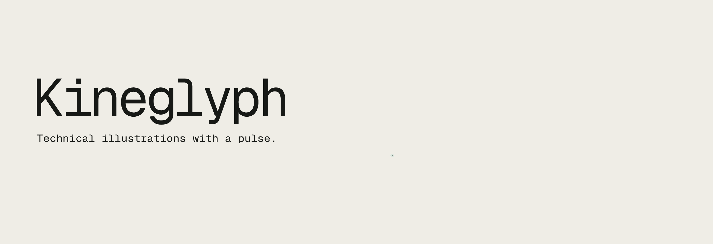
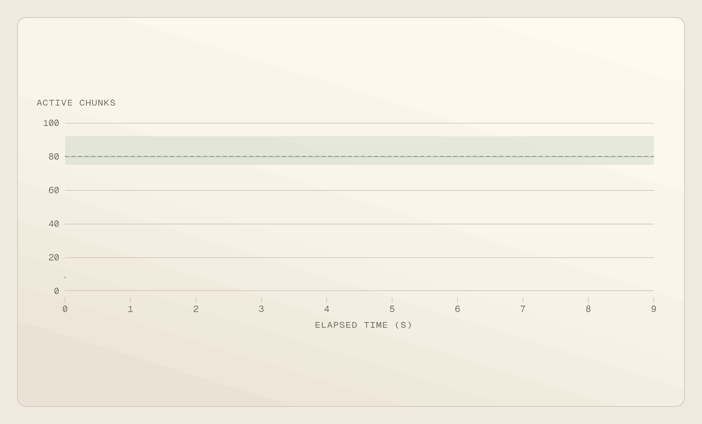

<p align="center">
  <picture>
    <source media="(prefers-reduced-motion: reduce)" srcset="./docs/assets/readme/cover@2x.png">
    
  </picture>
</p>

<p align="center">
  <a href="./docs/cookbook.md">Cookbook</a> ·
  <a href="./docs/authoring-api.md">Authoring API</a> ·
  <a href="./docs/materials-and-effects.md">Materials</a> ·
  <a href="./packages/plot/README.md">Plots</a> ·
  <a href="./packages/web/README.md">Web runtime</a> ·
  <a href="./packages/export/README.md">Export</a>
</p>

Kineglyph is a TypeScript scene system for technical diagrams, data graphics, and interactive
explainers. Geometry, motion, state, inspection data, and theme live in one serializable
definition. That definition can run as accessible SVG in a page or be exported to SVG, PNG, and
GIF.

The cover is a Kineglyph scene. Rebuild its PNG and GIF with `npm run render:readme-cover`.

## Compose a figure

`figure()` assigns stable ids, resolves responsive layout, routes connectors, and places motion on
one timeline.

```ts
import { figure } from "@kineglyph/core";

export const fillFigure = figure("fill", { title: "Shape plus brush" }, (f) => {
  const shape = f.card({
    eyebrow: "WHERE",
    title: "Sphere",
    body: "Selects cells",
    motif: "sphere",
    tone: "info",
  });
  const brush = f.card({
    eyebrow: "WHAT",
    title: "Stripes",
    body: "Chooses blocks",
    motif: "brush",
    tone: "warning",
  });
  const fill = f.card({ title: "BuildingTool.fill", motif: "blocks" });
  const result = f.card({ title: "Filled schematic", motif: "cube", tone: "success" });

  const where = f.connect(shape, fill, { route: "curve", head: "arrow", label: "where" });
  const what = f.connect(brush, fill, { route: "curve", head: "arrow", label: "what" });
  const build = f.connect(fill, result, { head: "arrow", label: "build" });

  f.root(f.flow([f.stack([shape, brush]), fill, result], { gap: 48 }));
  f.sequence([
    [f.reveal(shape), f.reveal(brush)],
    [f.draw(where), f.draw(what)],
    f.reveal(fill),
    f.draw(build),
    f.reveal(result),
  ]);
});
```

<p align="center">
  
</p>

Layout recipes include stack, row, grid, overlay, normalized coordinates, and absolute placement.
Every layout can supply `wide`, `compact`, and `narrow` values. The resolver recomputes geometry at
each breakpoint.

## Plot typed data

`plot<Row>()` checks channel names against the row type. It returns a normal scene fragment, so a
plot can sit inside a card or alongside other scene nodes. Gradient stops use theme colors and may
carry their own alpha.

```ts
import { alphaGradient, cubicBezier, figure, linearGradient } from "@kineglyph/core";
import { area, dot, line, plot, range, rule } from "@kineglyph/plot";

const activeChunks = [
  { second: 0, active: 8 },
  { second: 1, active: 21 },
  { second: 2, active: 39 },
  { second: 3, active: 62 },
  { second: 4, active: 78 },
  { second: 5, active: 86 },
  { second: 6, active: 82 },
  { second: 7, active: 88 },
  { second: 8, active: 84 },
  { second: 9, active: 87 },
];

const trend = plot(activeChunks, {
  id: "stream-trend",
  x: "second",
  y: "active",
  marks: [
    area({
      fill: alphaGradient("chart1", { from: 0.5, to: 0.015, angle: 90 }),
      fillOpacity: 1,
      curve: "monotone",
    }),
    line({ curve: "monotone" }),
    dot({ pointRadius: 3 }),
  ],
  annotations: [range({ y: [75, 92], label: "steady band" }), rule({ y: 80 })],
  axes: { x: { label: "Elapsed time (s)" }, y: { label: "Active chunks" } },
  motion: "auto",
  easing: cubicBezier(0.16, 1, 0.3, 1),
});

export const streamCard = figure("stream-card", { title: "Active chunks" }, (f) => {
  const chart = f.add(trend);
  const card = f.card({
    eyebrow: "STREAM SAMPLE",
    title: "Active chunks",
    badge: "87 active",
    extras: [chart],
    frame: {
      fill: linearGradient([
        { at: 0, color: "surfaceRaised" },
        { at: 1, color: "surfaceMuted" },
      ]),
      stroke: "border",
    },
  });
  f.root(card);
  f.sequence([f.reveal(card), f.reveal(chart)]);
});
```

<p align="center">
  
</p>

Bars, stacked bars, lines, areas, dots, heatmaps, and sparklines share the same theme, interaction,
and export path.

For an art-directed data story, `editorialBarChart` supplies responsive sizing and label density,
display typography, gradient/glow bars, zero labels, and rise motion in one typed call:

```ts
import { editorialBarChart, editorialDarkTheme } from "@kineglyph/plot";

const eclipses = editorialBarChart(data, {
  x: "eclipses",
  y: "years",
  title: "Solar eclipses in a year",
  subtitle: "2000 BCE – 3000 CE",
  axisLabel: "number of solar eclipses in the year",
});
```

The defaults remain ordinary plot options: override the fill, material, radius, axes, labels,
height, or motion without leaving the recipe.

## Visual direction belongs to the theme

A scene asks for semantic materials such as `raised`, `inset`, `floating`, or `glass`. The theme
decides what those words mean. Paint, elevation, grain, blur, compositing, and shader intent remain
plain serializable data.

```ts
import {
  alphaGradient,
  backdrop,
  createTheme,
  figure,
  material,
  noise,
  shader,
  shadow,
} from "@kineglyph/core";

const panel = figure("glass-panel", { title: "Glass panel" }, (f) => {
  const content = f.body("Normal accessible SVG content");
  f.root(f.stack([content], { padding: 24, frame: material("glass") }));
});

const glass = createTheme({
  materials: {
    glass: {
      fill: alphaGradient("surfaceRaised", { from: 0.72, to: 0.34, angle: 120 }),
      stroke: "border",
      effects: [
        backdrop({ blur: 24, saturation: 1.2 }),
        shader("frosted-glass", {
          uniforms: { refraction: 0.08 },
          fallback: [noise({ amount: 0.025, seed: 17 })],
        }),
        shadow({ color: "canvas", opacity: 0.5, blur: 34, offset: [0, 16] }),
      ],
    },
  },
});
```

These four images are the same scene definition:

<table>
  <tr>
    <td><br><sub>Layered paper</sub></td>
    <td><br><sub>Glass and procedural light</sub></td>
  </tr>
  <tr>
    <td><br><sub>Flat terminal</sub></td>
    <td><br><sub>Printed blocks</sub></td>
  </tr>
</table>

The browser runtime adds backdrop filtering and seekable WebGL shader surfaces for named effects.
SVG, PNG, and GIF use the effect's deterministic fallback, so enhancement never becomes a broken
export. See [Materials and effects](./docs/materials-and-effects.md).

```ts
import { heatmap, plot } from "@kineglyph/plot";

const matrix = plot(
  [
    { workload: "Dense", operation: "fill", speedup: 38 },
    { workload: "Dense", operation: "set", speedup: 8 },
    { workload: "Sparse", operation: "fill", speedup: 1 },
    { workload: "Sparse", operation: "set", speedup: 29 },
  ],
  {
    id: "operation-matrix",
    marks: heatmap({
      row: "workload",
      column: "operation",
      value: "speedup",
      domain: [0, 40],
      cellLabels: true,
    }),
  },
);

matrix.handles.cells?.[1]?.[1];
```

<p align="center">
  
</p>

## Animate the same scene

Timelines are serializable keyframe tracks. Curves can be named presets, cubic Bézier data, or a
damped spring. The browser runtime and exporter evaluate the same curve at arbitrary timestamps,
so seeking, live playback, and recorded frames agree.

<p align="center">
  
</p>

The GIF above is rendered at 2× and displayed smaller to keep edges and type crisp.

```sh
kineglyph-export gif \
  --scene './packages/scenes/dist/index.js#throughputOverTimeScene' \
  --theme './packages/scenes/dist/index.js#throughputPaperTheme' \
  --width-container 960 \
  --width 1920 \
  --fps 12 \
  --out throughput.gif
```

State machines can drive the same timeline. Events, guards, variables, actions, and derived
signals can bind to copy, visibility, tone, opacity, progress, and geometry. Random-access state
resolution keeps tests and exports deterministic.

```ts
import { cubicBezier, figure, spring } from "@kineglyph/core";

const draw = cubicBezier(0.16, 1, 0.3, 1);
const settle = spring({ frequency: 9.5, damping: 7.5 });

export const entrance = figure("entrance", { title: "Entrance" }, (f) => {
  const heading = f.title("A measured entrance");
  const stats = [f.card({ title: "71.5" }), f.card({ title: "88" })];
  f.root(f.stack([heading, f.row(stats)]));
  f.sequence([
    f.reveal(heading, { offset: 8, easing: draw }),
    f.reveal(stats, { scale: 0.97, stagger: 90, easing: settle }),
  ]);
});
```

## Embed it

The framework-neutral controller owns resize observation, playback, state events, inspection, and
cleanup.

```ts
import { mountKineglyph } from "@kineglyph/web";

const controller = mountKineglyph(document.querySelector("#figure"), { scene, theme });
controller.send("NEXT");
controller.seek(900);
```

React is a thin wrapper over that controller:

```tsx
import { KineglyphFigure } from "@kineglyph/react";

<KineglyphFigure figure={scene} theme={theme} />;
```

The self-contained browser bundle also works from a plain script tag or a Blade component. See the
working [Laravel example](./examples/laravel-blade/README.md).

## Packages

| Package             | Responsibility                                                    |
| ------------------- | ----------------------------------------------------------------- |
| `@kineglyph/core`   | scene schema, authoring, layout, edges, timelines, state machines |
| `@kineglyph/svg`    | accessible SVG serialization and motifs                           |
| `@kineglyph/anime`  | scoped Anime.js frame application                                 |
| `@kineglyph/plot`   | typed plots, scales, marks, axes, annotations, and stable handles |
| `@kineglyph/web`    | framework-neutral controller and browser bundle                   |
| `@kineglyph/react`  | React component and imperative handle                             |
| `@kineglyph/export` | SVG, PNG, GIF, and the `kineglyph-export` CLI                     |
| `@kineglyph/scenes` | twelve catalogue scenes, shared recipes, and three themes         |

## Run the workbench

Kineglyph requires Node.js 22.12 or newer.

```sh
npm install
npm run dev
```

The playground serves the catalogue at `#/`, individual scenes at `#/scene/<slug>`, and the plain
browser integration at `#/embed`.

```sh
npm run check
```

This runs formatting, builds every workspace, lints, typechecks, tests, and audits dependencies.

## Status

Kineglyph is pre-release. Package APIs may still change. The repository is MIT licensed.
