# Kineglyph

Kineglyph turns compact scene definitions into deterministic technical illustrations. The same
scene can be responsive, animated, interactive, themeable, rendered as SVG in a browser, or
exported reproducibly to PNG and GIF.

<figure markdown="span">
  
  <figcaption>The README cover is a Kineglyph scene—not a separate animation asset. Its PNG and GIF are sampled from the same timeline.</figcaption>
</figure>

[Install Kineglyph](./getting-started.md), browse the [visual gallery](./gallery.md), or edit the
example below directly in your browser.

Every live example waits until it enters the viewport, then plays after a short settle delay.
Choose **Edit figure** underneath when you want to change labels, tones, layout, data, or motion;
the result updates without reloading the page.

```kineglyph live id=first-live-figure view=preview height=440
import { sceneFromSpec } from "kineglyph";

export default sceneFromSpec({
  version: 1,
  id: "first-live-figure",
  title: "From source to explanation",
  layout: "row",
  gap: 18,
  padding: 28,
  nodes: [
    { id: "source", kind: "box", title: "Scene", body: "Plain serializable data", tone: "accent" },
    { id: "layout", kind: "box", title: "Resolve", body: "Layout for this container", tone: "info" },
    { id: "render", kind: "box", title: "Render", body: "SVG, PNG, GIF, or web", tone: "success" },
  ],
  edges: [
    { from: "source", to: "layout", label: "measure", style: "flow" },
    { from: "layout", to: "render", label: "draw", style: "flow" },
  ],
  timeline: "reveal",
});
```

The live editor uses Pagina's unified `kineglyph` browser module. Application code imports the
published `@kineglyph/*` packages directly.

## Start with the authoring surface

New figures normally begin with `figure()` for explanatory diagrams or `plot()` for quantitative
graphics. Both compile to the same serializable `SceneDefinition`; `defineScene()` remains the
low-level escape hatch.

- [Authoring API](./authoring-api.md) explains the model and compact builders.
- [Cookbook](./cookbook.md) collects complete patterns for layouts, charts, motion, and machines.
- [Materials and effects](./materials-and-effects.md) separates semantic structure from visual
  direction.
- [Editorial infographic patterns](./infographic-patterns.md) exercises process narratives,
  activity matrices, convergence lanes, change streams, and before/after claims.

## Ship the same scene everywhere

Use the framework-neutral web runtime, the React binding, or static exports. Container-width
layouts select `wide`, `compact`, or `narrow` rather than shrinking a desktop drawing until its
labels become unreadable.

- [Embedding and theming](./embedding-and-theming.md) covers hydration and the CSS token contract.
- [Live data and microcharts](./live-data-and-microcharts.md) spans WebSocket-fed figures and
  runtime-free SVGs small enough for massive tables.
- [Architecture](./architecture.md) follows a scene through resolution, rendering, animation, and
  export.

## A complete architecture figure

This responsive binding diagram is authored entirely with `figure()`, semantic cards and
materials, adaptive connector ports, inspection metadata, and one timeline. On a wide canvas the
generator fans out into six explicit routes; compact layouts replace those routes with one clear
group handoff.



The same scene also exports to PNG and animated GIF without maintaining a second drawing.
